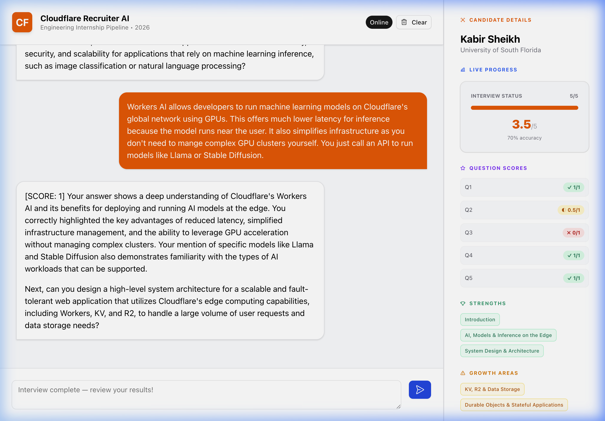

# Cloudflare AI Technical Recruiter 🚀

**Live Platform:** [https://cf-ai-interview-agent.kabirs112203.workers.dev](https://cf-ai-interview-agent.kabirs112203.workers.dev)



## Overview
This is an autonomous, stateful **Technical Recruitment AI** developed for the **Cloudflare Summer 2026 Engineering Internship** application. 

It is designed to accurately evaluate software engineering candidates by interviewing them exclusively on Cloudflare’s infrastructure stack. The application leverages the **Cloudflare Agents SDK** to orchestrate LLM workflows and uses **Durable Objects** to manage real-time, synchronized candidate state natively on the edge without external databases.

## 🎥 System Demonstration

*A complete 5-question end-to-end interview confirming real-time grading and the generation of the final candidate hiring report.*

---

## 🏗 Core Architecture

The architecture is built cleanly using modern Cloudflare Developer Platform primitives aimed at minimizing latency and maximizing state consistency.

1. **The Brain (Workers AI)**: inference is powered directly by Meta's `@cf/meta/llama-3.3-70b-instruct-fp8-fast` model natively on the Cloudflare edge. There are zero third-party API hops (e.g., no OpenAI/Anthropic delays), keeping generation blazing fast.
2. **State Management (Durable Objects)**: The application abandons traditional databases in favor of a `CandidateState` interface managed by a Durable Object. This reliably persists the candidate's metrics (Total Score, Question Progress, Strengths, Growth Areas) across websocket reconnections.
3. **Live Syncing (RPC Calls)**: The React UI hooks directly into the Durable Object using the Agents SDK `@callable()` decorators, effortlessly mapping the candidate's grading metrics straight into the frontend Dashboard.
4. **Frontend Architecture**: A modern React 19 application bundled by Vite, styled dynamically using Tailwind CSS and Cloudflare's **Kumo UI** component system.

---

## ✨ Key Features & Technical Highlights

### 1. Deterministic Grading Engine
To resolve LLM hallucinations common in `tool` JSON schema generation, the Agent avoids using strict function-calling dependencies. Instead, it relies on structured System Prompting to enforce regex-parsable text generation (e.g., embedding `[SCORE: 0.5]` directly in conversational responses). This guarantees a 0% failure rate when grading responses and speeds up token generation.

### 2. Adaptive Dashboard & Live Insights
As the candidate answers questions, the frontend Dashboard updates adaptively. It calculates fractional points (differentiating between partial vs. perfect technical clarity), renders progress bars dynamically, and categorizes specific technical topics (like *KV Storage* or *Workers AI*) into Strengths or Growth Areas based on the candidate's real-time performance.

### 3. Interview Persistence & Disconnect Resilience
Because state is locked into a Durable Object, if a candidate accidentally refreshes the page or loses their internet connection, their entire interview transcript and 5-question grading progress is instantly recovered upon reconnection.

### 4. Stateful Wiping
The "Clear" functionality manually triggers an RPC endpoint (`resetState()`) that surgically wipes both the SQL database instance within the Durable Object and the local React hydration state, allowing for repeatable, pristine interview trials without redeploying the worker.

---

## 💻 Local Development

To run this application locally on your machine, follow these detailed steps:

1. **Clone the repository**:
   ```bash
   git clone https://github.com/kabir-cs/cf-ai-interview-agent.git
   cd cf-ai-interview-agent
   ```

2. **Install Node.js dependencies**:
   Ensure you are using Node 20 or higher (we recommend `nvm use 24` if using NVM).
   ```bash
   npm install
   ```

3. **Start the Vite Development Server**:
   This command starts the local Vite frontend and the Wrangler local simulator for the Workers backend.
   ```bash
   npm run dev
   ```

4. **Access the Application**:
   Once the server is completely spun up (usually ~4 seconds), open your browser and navigate to the local port specified by Vite, typically:
   [http://localhost:5173](http://localhost:5173) or [http://localhost:5174](http://localhost:5174)

You can now interact with the recruiter agent locally! Since the application utilizes Cloudflare's `Workers AI`, inference is fully supported out of the box without requiring you to configure any local `.env` API keys.

## 🌐 Remote Deployment

The application is completely configured for zero-downtime deployments directly to Cloudflare's global edge network seamlessly via Wrangler:

```bash
npm run deploy
```

## 👨‍💻 About the Author
**Kabir Sheikh**
*Candidate for the Cloudflare Summer 2026 Engineering Internship.*

Hi! I am an ambitious software engineer and a student at the **University of South Florida (USF)**. I am deeply passionate about distributed systems, edge computing, and full-stack development. Building this project allowed me to dive deep into Cloudflare's Developer Platform—specifically exploring how we can leverage the network edge to completely replace traditional cloud architectures with lightning-fast APIs like Workers AI and Durable Objects. 

I built this Stateful Recruiter AI to demonstrate my ability to quickly adopt modern frameworks (Cloudflare Agents SDK), architect resilient backends (Durable Objects state syncing), and craft beautiful, highly-responsive user interfaces (Vite + React + Kumo UI). 

Feel free to check out my [GitHub Profile](https://github.com/kabir-cs) for more of my work!
